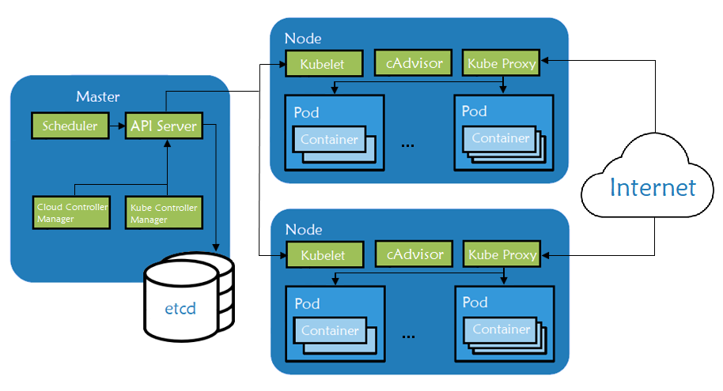
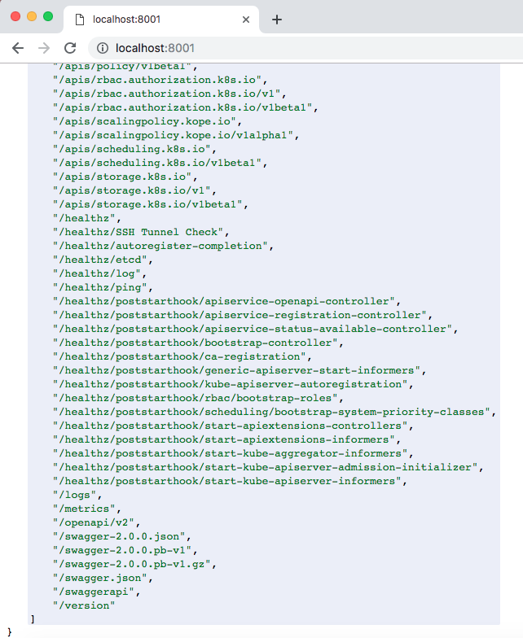
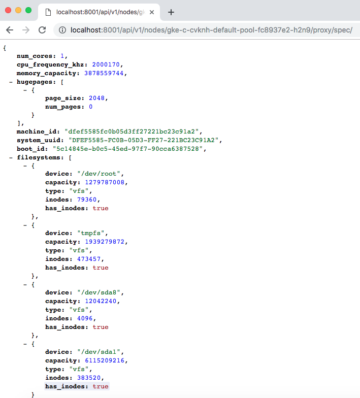
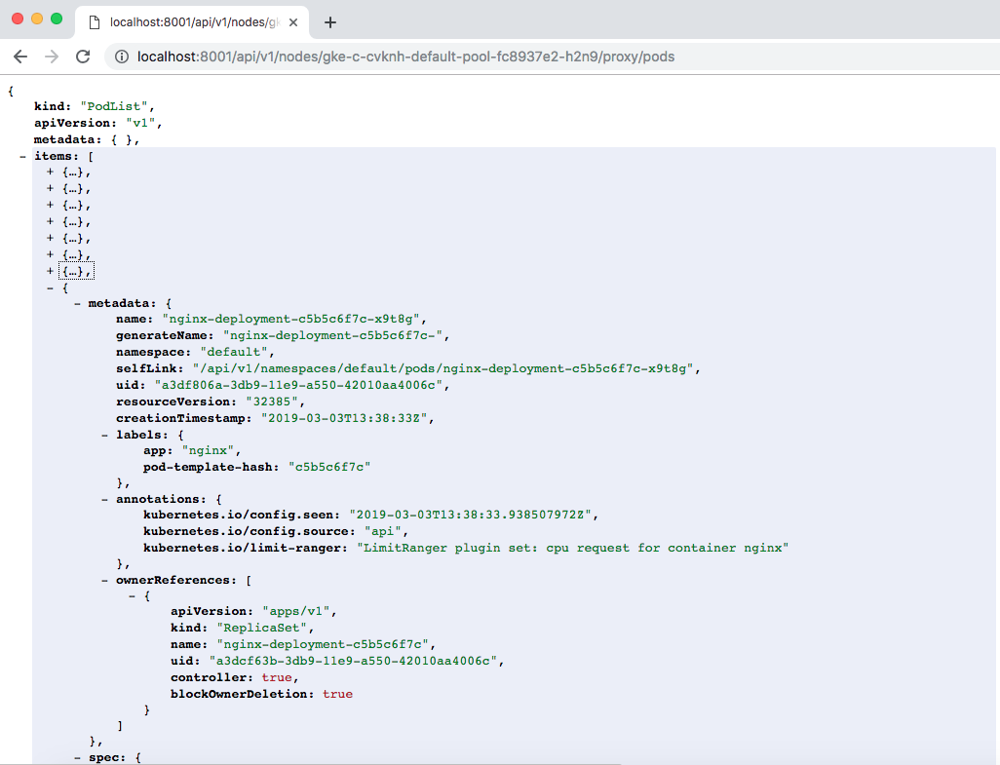
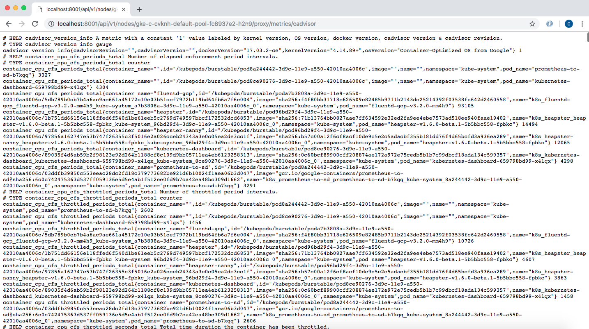

## Introduction

With over 48,000 stars on Github, more than 75,000 commits, and with major contributors like Google and Redhat, Kubernetes has rapidly taken over the container ecosystem to become the true leader of container orchestration platforms. Some reasons for this are its great features like rolling and rollback of deployments, container health-check, automatic container recovery, container auto-scaling based on metrics, service load balancing, service discovery (great for microservice architecture) and more. In this article we will speak about some basic Kubernetes concepts and it's master-node architecture, concentrating on the node components.

## Understanding Kubernetes and Its Abstractions

As we know Kubernetes is an open-source orchestration engine for automating deployments, scaling, managing and providing the infrastructure to host containerized applications. At the infrastructure level, a Kubernetes cluster is a set of physical or virtual machines acting in a specific role. The machines acting in the role of **Master** act as the brain of all operations and are charged with orchestrating containers that run on all of the **Nodes**. Each node is equipped with a container runtime. The node receives instruction from the master and then takes actions based on that to either create pods, delete them or adjust networking rules.



- [Master components](https://kubernetes.io/docs/concepts/overview/components/#master-components) provide the cluster’s control plane. They manage the lifecycle of a pod, the base unit of deployment within a Kubernetes cluster.
    - `kube-apiserver` - exposes APIs for the other master components.
    - `etcd` - a consistent and highly-available key/value store used for storing all internal cluster data.
    - `kube-scheduler` - uses information in the Pod spec to decide on which Node to run a Pod. 
    - `kube-controller-manager` - responsible for Node management (detecting if a Node fails), pod replication, and endpoint creation.
    - `cloud-controller-manager` - runs controllers that interact with the underlying cloud providers. 

- [Node components](https://kubernetes.io/docs/concepts/architecture/nodes/#what-is-a-node) are worker machines in Kubernetes and are managed by the Master. A node may be a virtual machine (VM) or physical machine, and Kubernetes runs equally well on both types of systems. Each node contains the necessary components to run pods:
    - [`kubelet`](https://kubernetes.io/docs/reference/command-line-tools-reference/kubelet/) - watches the API server for pods on that node and makes sure they are running
    - [`cAdvisor`](https://github.com/google/cadvisor) - collects metrics about pods running on that particular node
    - [`kube-proxy`](https://kubernetes.io/docs/reference/command-line-tools-reference/kube-proxy/) - watches the API server for pods/services changes in order to maintain the network up to date
    - container runtime - responsible for watching and managing container images on that node

## Kubernetes Node components in details

Basically the Node runs the two most important components, the kubelet and the kube-proxy as well as a container engine, in charge of running the containerized applications.

- `kubelet` handles all communication between the Master and the node on which it is running. Kubelet is an agent that runs on each node and receives commands from the Master in the form of a **manifest** which defines the workload and the operating parameters. It interfaces with the container runtime, being responsible for creating, starting and monitoring pods. A pod is a collection of containers that can share resources, volumes and a single IP. The kubelet also periodically executes any configured liveness probes and readiness checks. It is constantly monitoring the state of the pods and in case there is a problem a new one will be launched instead. The kubelet also has an internal HTTP server exposing a read-only view at port 10255. There’s a health check endpoint at `/healthz`. There are also a few status endpoints. For example, we can get a list of running pods at `/pods`.
You can also get specs of the machine the kubelet is running on at `/spec`.

- `kube-proxy` runs on each node and proxies UDP, TCP and SCTP (doesn't understand HTTP). It maintains the network rules on the host and handles transmission of packets between pods, the host, and the outside world. It acts like a network proxy and load balancer for pods running on the node by implementing east/west load-balancing using NAT in iptables. It stands in between the network Kubernetes is attached to and the pods that are running on that particular node. It is essentially the core networking component of Kubernetes being responsible for ensuring that communication is maintained efficiently across all elements of the cluster. When user creates a Kubernetes service object the kube-proxy is responsible to translate that object in meaningful rules in the local iptables worked node. Iptables is used to translate the virtual IP assigned to the service object to all the pods IPs mapped by the service.

- `container runtime` is responsible for pulling the images from the public or private registry and running the container based on that image. The most popular engine is [Docker](https://www.docker.com), although Kubernetes supports container runtimes from [rkt](https://coreos.com/rkt/), [runc](https://github.com/opencontainers/runc) and [others](https://github.com/opencontainers/runtime-spec). As previously stated kubelet interacts directly with container runtime to start, stop or delete containers.

- `cAdvisor` is an open source agent that monitors resource usage and analyzes the performance of containers. Originally created by Google, cAdvisor is now integrated with the Kubelet. It collects, aggregates, processes and exports metrics such as CPU, memory, file and network usage for all containers running on a given node. All the data is being sent to the scheduler so this knows what's going on inside of the node. This information is needed in order to perform various orchestration tasks like scheduling, horizontal pod scaling or managing container resource limits.

## Observing Node components endpoints

To perform this demo you will need the following:
- a Google Cloud Platform account, the free tier provided is more than enough (any other cloud should work the same)
- [Rancher](https://rancher.com)
- Kubernetes cluster running on Google Kubernetes Engine (running EKS or AKS should be the same)

### Starting a Rancher 2.0 instance
To begin, start a Rancher 2.0 instance. There is a very intuitive getting started guide for this purpose [here](https://rancher.com/quick-start/).

### Using Rancher to deploy a GKE cluster
Use Rancher to set up and configure your Kubernetes cluster, follow the how-to [guide](https://rancher.com/docs/rancher/v2.x/en/cluster-provisioning/hosted-kubernetes-clusters/gke/).

We will need a machine (best for this demo would be your own PC/Mac) with `Google Cloud SDK` and `kubelet` installed. Make sure that gcloud has access to the Cloud Platform with Google user credentials (`gcloud init` and `gcloud auth login`).
As soon as cluster is deployed, we can make a quick nginx deployment (used for testing).

```yaml
$ cat nginx_deployment.yaml 
---
 apiVersion: extensions/v1beta1
 kind: Deployment
 metadata:
   name: nginx-deployment
 spec:
   replicas: 3
   template:
     metadata:
       labels:
         app: nginx
     spec:
       containers:
         - name: nginx
           image: nginx
           ports:
             - containerPort: 80
```

```bash
$ kubectl apply -f nginx_deployment.yaml 
deployment.extensions "nginx-deployment" created
```

In order to interact with Kubernetes API we need to start locally (on our PC/Mac) a proxy server.

```
$ kubectl proxy &
[1] 3349
$ Starting to serve on 127.0.0.1:8001
```

Let's check the process to see it is running and listening to the default port:

```
$ netstat -anp | grep 8001 | grep LISTEN
tcp        0      0 127.0.0.1:8001          0.0.0.0:*               LISTEN      3349/kubectl
```

Now, from the local browser we can check the numerous endpoints the kubelet exposes.



For any of the nodes listed below we can check the `spec` using the API. In this example we created a 3 node cluster, `n1-standard-1` (1 vCPU, 3.75GB RAM, root size disk of 10GB), specs that can be confirmed by accessing the dedicated endpoint.

```bash
$ kubectl get nodes
NAME                                     STATUS   ROLES    AGE     VERSION
gke-c-cvknh-default-pool-fc8937e2-h2n9   Ready    <none>   3h13m   v1.12.5-gke.5
gke-c-cvknh-default-pool-fc8937e2-hnfl   Ready    <none>   3h13m   v1.12.5-gke.5
gke-c-cvknh-default-pool-fc8937e2-r4z1   Ready    <none>   3h13m   v1.12.5-gke.5
```

```
$ curl http://localhost:8001/api/v1/nodes/gke-c-cvknh-default-pool-fc8937e2-h2n9/proxy/spec/
$ curl http://localhost:8001/api/v1/nodes/gke-c-cvknh-default-pool-fc8937e2-hnfl/proxy/spec/
$ curl http://localhost:8001/api/v1/nodes/gke-c-cvknh-default-pool-fc8937e2-r4z1/proxy/spec/
```



Using same kubelet API (different endpoint), we can check the nginx pods we created to see what nodes they are running on.

```
$ kubectl get pods
NAME                               READY     STATUS    RESTARTS   AGE
nginx-deployment-c5b5c6f7c-d429q   1/1       Running   0          1m
nginx-deployment-c5b5c6f7c-w7qtc   1/1       Running   0          1m
nginx-deployment-c5b5c6f7c-x9t8g   1/1       Running   0          1m
```

```
$ curl http://localhost:8001/api/v1/nodes/gke-c-cvknh-default-pool-fc8937e2-h2n9/proxy/pods
$ curl http://localhost:8001/api/v1/nodes/gke-c-cvknh-default-pool-fc8937e2-hnfl/proxy/pods
$ curl http://localhost:8001/api/v1/nodes/gke-c-cvknh-default-pool-fc8937e2-r4z1/proxy/pods
```




Also we can check the cAdvisor endpoint, with lots of data in Prometheus format. They are served by default under the `/metrics` HTTP endpoint.

```
$ curl http://localhost:8001/api/v1/nodes/gke-c-cvknh-default-pool-fc8937e2-h2n9/proxy/metrics/cadvisor
```



Same cAdvisor information can be obtained by SSHing into the node and making direct calls to the kubelet port.

```
$ gcloud compute ssh admin@gke-c-cvknh-default-pool-fc8937e2-h2n9 --zone europe-west4-c
admin@gke-c-cvknh-default-pool-fc8937e2-h2n9 ~ $ curl localhost:10255/metrics/cadvisor
```

## Conclusions

In this article, we’ve discussed about the key components of the Kubernetes Node architecture. Then we deployed using Rancher a Kubernetes cluster and made a quick and small deployment which helped us while playing with the `kubelet` API. To learn more about Kubernetes and its architecture, a great starting point is the official [documentation](https://kubernetes.io/docs/concepts/overview/components/).


